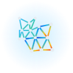

<p align="center">
  
</p>

<h1 align="center">ThoRemesher</h1>

<p align="center">
  <em>Curvature-aware adaptive remeshing for 3D models</em>
</p>

<p align="center">
  
  
  
  
  
</p>

---

A local web app that takes any 3D model (FBX / GLB / GLTF / OBJ / PLY / STL), **keeps dense topology where the surface changes direction, simplifies flat areas, preserves sharp creases, and rebuilds clean near-isotropic topology** — all in a live, camera-linked **before / after** split view.

<p align="center">
  <strong>Flat areas get coarse · Detailed areas stay dense · Sharp edges are preserved</strong>
</p>

---

## What It Does

| Region | Behavior |
|:-:|---|
| **Flat** (torso, walls) | Aggressively simplified — large, clean triangles |
| **Curved** (fingers, face, limbs) | Kept dense — fine topology preserved |
| **Creases** (hard edges) | Locked in place — feature edges survive remesh |

## Features

- **True curvature detection** — VTK's discrete mean curvature (`vtkCurvatures`) computed on the full mesh in ~0.2s, catching smooth curvature that simple normal variation misses
- **Curvature-weighted QEM decimation** — the primary engine that preserves ~3× density contrast between flat and detailed regions
- **Tangential smoothing** — improves triangle quality (valence, aspect ratio) without destroying the density distribution or surface shape
- **Topology cleanup** — repairs non-manifold edges/vertices, duplicates, and T-vertices for a clean, renderable mesh
- **Dual camera-linked viewers** — compare original vs. remeshed in real time, both rotating/panning in sync
- **Live curvature heatmap** — blue (flat) → red (detailed), so you can verify the logic visually
- **Presets** — 5 built-in presets + save your own (stored in browser localStorage)
- **Export** — download the result as **GLB, OBJ, PLY, or STL**
- **Drag & drop** — drop any supported mesh format anywhere on the window

## Quick Start

```bash
./run.sh
# then open http://127.0.0.1:8000
```

Drop a `.fbx` / `.glb` / `.obj` … into the window, pick a preset, press **Remesh**.

## Requirements

- Python 3.10+
- A WebGL-capable browser (for the viewer)

<details>
<summary><strong>Dependencies</strong></summary>

```bash
pip install -r requirements.txt
```

| Library | Role |
|---|---|
| **pyvista / VTK** | `vtkCurvatures` for accurate discrete mean curvature |
| **pymeshlab** | FBX/GLB/OBJ/PLY/STL I/O, QEM decimation, topology cleanup |
| **pyassimp** (libassimp) | robust FBX reading |
| **trimesh / scipy** | mesh utilities, KD-tree transfer, GLB serialization |
| **fastapi / uvicorn** | backend server |

> **Note:** `pyassimp` requires `libassimp` installed system-wide. On Debian/Ubuntu: `sudo apt install libassimp-dev`.

</details>

## How It Works

The pipeline implements exactly this logic:

1. **Score every vertex** by how much the surface "changes direction" there — flat → ~0, detailed → high
2. **QEM decimation** collapses flat regions first (curvature-weighted), keeping detail dense
3. **Tangential smoothing** rebuilds clean triangles without changing the density distribution
4. **Cleanup** produces a manifold, renderable mesh
5. **Heatmap** colors vertices blue→red so you can see the curvature field

<p align="center">
  
  <br/>
  <em>Left: dense detail · Right: simplified flats — the logo shows the density gradient</em>
</p>

## Controls

| Control | Meaning |
|---|---|
| Flat-area edge size | overall reduction level (higher = fewer faces) |
| Detail edge size | relative edge size in detailed regions |
| Contrast | sharpness of the flat ⇄ detailed transition |
| Feature angle | creases sharper than this (dihedral °) are preserved |
| Iterations | tangential smoothing passes (more = smoother triangles) |
| Detail retention | pre-simplification threshold for very dense meshes |

### Built-in Presets

| Preset | Use case |
|---|---|
| **Balanced (recommended)** | general-purpose reduction with detail preservation |
| **High detail (characters)** | keeps more geometry for organic/character models |
| **Max reduction (game-ready)** | aggressive simplification for real-time rendering |
| **Aggressive simplify** | maximum reduction with pre-simplification pass |
| **Gentle cleanup** | light remeshing, mostly topology improvement |

## Pipeline Quality

Measured on a 480k-face character model:

| Setting | Result faces | Reduction | Density contrast | Triangle quality | Non-manifold | Time |
|---|---|---|---|---|---|---|
| flat=3, iter=4 | 53k | 89% | 4.0× | 0.88 | 0 | 6s |
| flat=5, iter=4 | 19k | 96% | 3.1× | 0.86 | 0 | 7s |
| flat=8, iter=2 | ~7.5k | 98.5% | 2.8× | 0.84 | 0 | 5s |

*Density contrast = ratio of average face area in flat regions vs detailed regions (higher = better preservation of detail where it matters).*

## Files

| File | Purpose |
|---|---|
| `remesh_engine.py` | loading, curvature, QEM decimation, smoothing, cleanup, export |
| `adaptive_remesh.py` | split / collapse / flip / tangential-smooth remesher |
| `app.py` | FastAPI server (`/api/upload`, `/api/remesh`, `/api/model`, `/api/export`) |
| `static/index.html` | UI layout: sidebar, dual viewers, drag-drop |
| `static/app.js` | Three.js viewers, linked cameras, presets, export |
| `static/style.css` | styling |

---

<p align="center">
  MIT License
</p>
